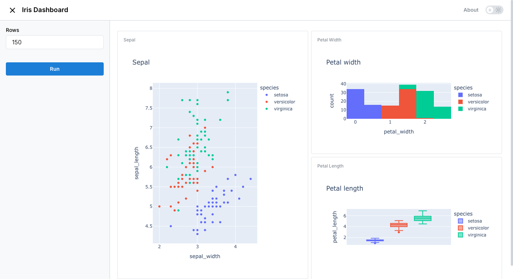
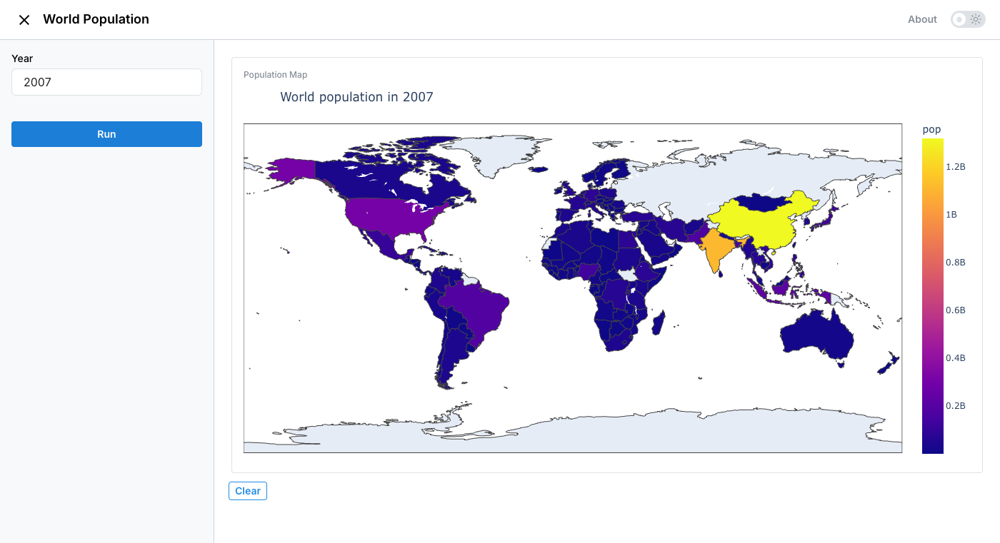
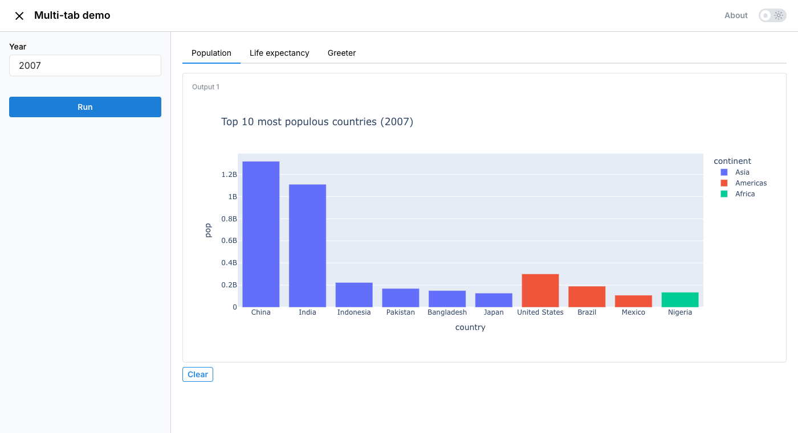
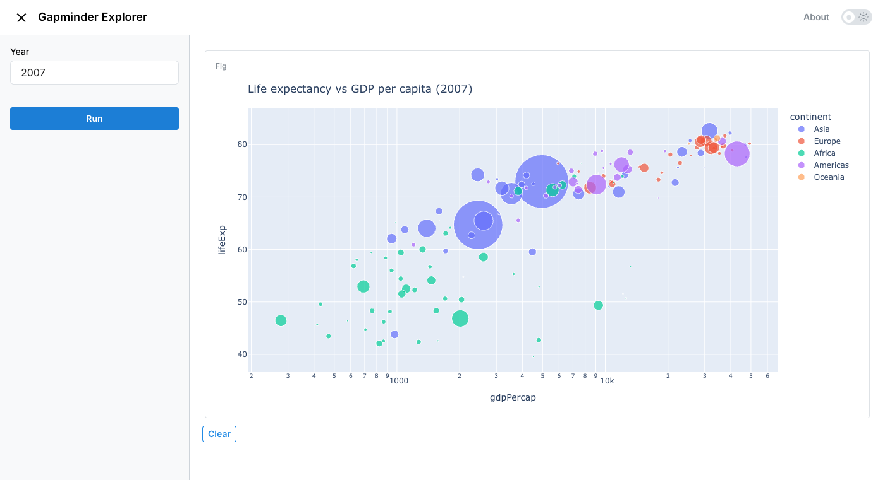

<p align="center">
  <a href="https://fastdash.app/"></a>
</p>
<p align="center">
    <em>Turn any Python function into a web app with a single decorator ⚡</em>
</p>
<p align="center">
<a href="https://pypi.python.org/pypi/fast_dash">
    
</a>
<a href="https://github.com/dkedar7/fast_dash/actions">
    
</a>
<a href="https://github.com/dkedar7/fast_dash/blob/main/LICENSE">
    
</a>
<a href="https://docs.fastdash.app/">
    .svg?labelColor=black&color=%2334D058" alt="Documentation">
</a>
<a href="https://pepy.tech/project/fast-dash">
    
</a>
<a href="https://codecov.io/gh/dkedar7/fast_dash">
    
</a>
</p>

---

- **Documentation**: [docs.fastdash.app](https://docs.fastdash.app)
- **Source**: [github.com/dkedar7/fast_dash](https://github.com/dkedar7/fast_dash)
- **Install**: `pip install fast-dash`
- **Claude Code users**: `/plugin marketplace add dkedar7/fast_dash` then `/plugin install fast-dash@fast-dash` to load the Fast Dash skill — agents will pick it up automatically when you ask them to "turn this function into a web app".

---

## What is Fast Dash?

Fast Dash inspects your Python function's signature, picks UI components from the type hints and default values, and serves the result as a [Plotly Dash](https://github.com/plotly/dash) app — usually in under five lines of code. No frontend, no callbacks, no boilerplate.

It exists for one job: collapse the gap between a working Python function and a shareable interactive web app.

## What you can build

Each app below is a single Python function decorated with `@fastdash`. Click any image to see the code.

<table>
<tr>
<td width="50%">
<a href="#mosaic-dashboard"></a>
<p align="center"><sub><b>Multi-output dashboard</b> — return a tuple of charts, lay them out with <code>mosaic="AB\nAC"</code></sub></p>
</td>
<td width="50%">
<a href="#choropleth-map"></a>
<p align="center"><sub><b>Choropleth map</b> — Plotly's geographic charts work out of the box</sub></p>
</td>
</tr>
<tr>
<td width="50%">
<a href="#multi-tab-app"></a>
<p align="center"><sub><b>Multi-function tabs</b> — pass a list of functions, get a tab per function</sub></p>
</td>
<td width="50%">
<a href="#gapminder-explorer"></a>
<p align="center"><sub><b>Interactive chart</b> — type-hint defaults become inputs, the function re-runs on demand</sub></p>
</td>
</tr>
</table>

<details>
<summary><b>Code for each example</b></summary>

<a name="mosaic-dashboard"></a>
**Mosaic dashboard**

```python
from fast_dash import fastdash, Graph
import plotly.express as px

@fastdash(
    mosaic="AB\nAC",
    output_labels=["Sepal", "Petal width", "Petal length"],
)
def iris_dashboard(rows: int = 150) -> (Graph, Graph, Graph):
    """Explore the Iris dataset with linked plots."""
    df = px.data.iris().head(rows)
    sepal = px.scatter(df, x="sepal_width", y="sepal_length", color="species")
    petal_width = px.histogram(df, x="petal_width", color="species")
    petal_length = px.box(df, y="petal_length", color="species")
    return sepal, petal_width, petal_length
```

<a name="choropleth-map"></a>
**Choropleth map**

```python
from fast_dash import fastdash, Graph
import plotly.express as px

@fastdash
def world_population(year: int = 2007) -> Graph:
    """World population by country."""
    df = px.data.gapminder().query(f"year == {year}")
    return px.choropleth(
        df, locations="iso_alpha", color="pop", hover_name="country",
        color_continuous_scale=px.colors.sequential.Plasma,
        title=f"World population in {year}",
    )
```

<a name="multi-tab-app"></a>
**Multi-function tabs**

```python
from fast_dash import FastDash, Graph
import plotly.express as px

def population_chart(year: int = 2007) -> Graph:
    df = px.data.gapminder().query(f"year == {year}")
    return px.bar(df.nlargest(10, "pop"), x="country", y="pop", color="continent")

def life_expectancy(year: int = 2007) -> Graph:
    df = px.data.gapminder().query(f"year == {year}")
    return px.box(df, x="continent", y="lifeExp", color="continent")

def greet(name: str = "world") -> str:
    return f"Hello, {name}!"

FastDash(
    callback_fn=[population_chart, life_expectancy, greet],
    tab_titles=["Population", "Life expectancy", "Greeter"],
).run()
```

<a name="gapminder-explorer"></a>
**Interactive Gapminder chart**

```python
from fast_dash import fastdash, Graph
import plotly.express as px

@fastdash
def gapminder_explorer(year: int = 2007) -> Graph:
    """Life expectancy vs GDP per capita."""
    df = px.data.gapminder().query(f"year == {year}")
    return px.scatter(
        df, x="gdpPercap", y="lifeExp", size="pop", color="continent",
        log_x=True, hover_name="country", size_max=60,
        title=f"Life expectancy vs GDP per capita ({year})",
    )
```

</details>

## 30-second example

```bash
pip install fast-dash
```

```python
from fast_dash import fastdash

@fastdash
def greet(name: str = "world") -> str:
    return f"Hello, {name}!"

# Serving on http://127.0.0.1:8080
```

That's the entire app. Open the URL, type a name, click Run, see the response.

## How it works

The `@fastdash` decorator does three things at import time:

1. **Inspects the function signature** — each parameter becomes an input component, the return becomes an output component.
2. **Picks components from type hints and defaults** — `int` → number input, `bool` → checkbox, `pd.DataFrame` → table, etc. (full table below).
3. **Builds a Dash app and starts the server** — the function body is wired as the callback that runs when the user clicks Run.

You can override any of this by passing components explicitly via `inputs=` and `outputs=`, or by skipping the decorator and using the `FastDash(...)` class directly.

## Type hint → component reference

Inputs (parameter type → UI component):

| Type hint | Component |
| --- | --- |
| `str` | Textarea |
| `str` with `default=[...]` | Single-select dropdown |
| `int`, `float` | Number input |
| `int`/`float` with `range(...)` default | Slider |
| `bool` | Checkbox |
| `list` | Multi-select dropdown |
| `dict` (with default) | Multi-select dropdown (keys) |
| `datetime.date` | Date picker |
| `PIL.Image.Image` | Image upload |
| `Literal["a", "b"]` | Single-select dropdown |
| `enum.Enum` subclass | Single-select dropdown |
| `Annotated[int, range(0, 100)]` | Slider |
| `Annotated[str, ["a", "b"]]` | Single-select dropdown |
| `Optional[T]` | As `T`, but nullable |
| Any Dash component instance | Used directly |
| Any Fast Dash component (`Text`, `Slider`, ...) | Used directly |

Outputs (return type → UI component):

| Return type | Component |
| --- | --- |
| `str`, `int`, `float`, etc. | Text (rendered as `<h1>`) |
| `pd.DataFrame` | Table |
| `PIL.Image.Image`, `matplotlib.figure.Figure` | Image |
| `plotly.graph_objects.Figure` (or string-form `"go.Figure"`, `"Figure"`) | Plotly chart |
| Tuple of types | Multiple outputs (one component each) |
| Any Fast Dash component (`Graph`, `Image`, ...) | Used directly |

```python
from fast_dash import fastdash, Graph

@fastdash
def chart(rows: int = 100) -> Graph:
    import plotly.express as px
    return px.scatter(px.data.iris().head(rows), x="sepal_width", y="sepal_length")
```

Unknown hints fall back to text. Source-introspection failures (REPL, `exec`) fall back to generic `OUTPUT_1`, `OUTPUT_2` labels — the app still works.

### Built-in components

The package exports ready-to-use Fast Dash components you can pass directly as `inputs=` or `outputs=`:

| Component | Use as | Notes |
| --- | --- | --- |
| `Text`, `TextArea`, `PasswordInput` | input or output | Single-line, multi-line, masked text |
| `NumberInput`, `Slider` | input | Numeric with optional bounds |
| `Switch` | input | Toggle (True / False) |
| `MultiSelect` | input | Multi-select dropdown |
| `DateInput`, `DateRange` | input | Single date / date range picker |
| `ColorInput` | input | Color picker, returns hex |
| `Upload`, `UploadImage` | input | File / image upload |
| `Graph`, `Image`, `Table`, `Markdown` | output | Plotly chart, image, DataFrame table, rendered Markdown |
| `Chat` | output | Streaming chat history (with `stream=True`) |
| `Download` | output | Triggers a browser download |

## Common patterns

**Multiple inputs and outputs**

```python
from fast_dash import fastdash

@fastdash
def describe(text: str, count: int = 3) -> str:
    """Repeat text `count` times."""
    return " · ".join([text] * count)
```

**Mosaic layout** for arranging multiple outputs:

```python
from fast_dash import fastdash, Graph
import plotly.express as px
import pandas as pd

@fastdash(mosaic="AB\nAC")
def dashboard(rows: int = 100) -> (Graph, Graph, Graph):
    df = px.data.iris().head(rows)
    return (
        px.scatter(df, x="sepal_width", y="sepal_length", color="species"),
        px.histogram(df, x="petal_width"),
        px.box(df, y="petal_length", color="species"),
    )
```

The mosaic string is ASCII art (inspired by Matplotlib's `subplot_mosaic`). Each letter corresponds to one output, in order.

**Wrapping arbitrary Dash components** with `Fastify`:

```python
from fast_dash import fastdash, Fastify
from dash import dcc

custom_slider = Fastify(dcc.Slider(min=0, max=100, value=50), "value")

@fastdash
def my_app(x: custom_slider) -> str:
    return f"You picked {x}"
```

**Cascading inputs** with `depends_on` — wire one input's options to another input's value:

```python
from fast_dash import fastdash, depends_on

countries = {
    "USA": ["California", "Texas", "New York"],
    "India": ["Maharashtra", "Karnataka", "Delhi"],
}

@fastdash
def pick_state(
    country: str = list(countries),
    state: str = depends_on("country", lambda c: countries[c]),
) -> str:
    return f"{state}, {country}"
```

The resolver receives the parent input's current value. Return:
- a **list** to set the dependent dropdown's options (and clear its value),
- a **dict** like `{"data": [...], "value": ...}` to set both, or
- a **scalar** to set just the value.

**Skip the decorator** when you want more control over the lifecycle:

```python
from fast_dash import FastDash

def my_fn(x: int) -> int: return x * 2

app = FastDash(callback_fn=my_fn, title="Doubler", port=8050)
app.run()
```

**Multiple functions in a single tabbed app** — pass a list of callbacks:

```python
from fast_dash import FastDash

def greet(name: str) -> str:
    return f"Hello, {name}!"

def add(a: int, b: int) -> int:
    return a + b

app = FastDash([greet, add], tab_titles=["Greeter", "Adder"])
app.run()
```

Each function gets its own tab with independent inputs, outputs, and callbacks. `tab_titles` is optional — without it, tabs are named after the functions.

**Multi-step pipelines** with `steps=` — chain functions into a wizard, threading outputs forward via `from_step`:

```python
from fast_dash import FastDash, from_step
import pandas as pd

def load_data(rows: int = 100) -> pd.DataFrame:
    """Load a sample dataset."""
    return pd.DataFrame({"x": range(rows), "y": [i * 2 for i in range(rows)]})

def double(data=from_step(load_data)) -> pd.DataFrame:
    """Double every value."""
    return data * 2

def summarise(data=from_step(double), prefix: str = "Result:") -> str:
    """One-line summary."""
    return f"{prefix} {len(data)} rows, sum={data.values.sum()}"

FastDash(steps=[load_data, double, summarise], title="Pipeline Demo").run()
```

Each step is shown one at a time with a stepper progress indicator. Click **Run** to execute the active step, then **Next** to advance. Use `from_step(prev_fn)` as a parameter default to wire an upstream output into a downstream input. Steps without `from_step` parameters can mix in regular UI inputs (like `prefix` above).

## Drive your app from an AI agent (MCP)

Pass `mcp_server=True` and your app serves a web UI **and** an [MCP](https://modelcontextprotocol.io) server — built on [Dash's native MCP](https://dash.plotly.com) (Dash ≥ 4.3) and mounted on the **same port** — so any MCP-capable agent (Claude Code, Cursor, Cline, …) can inspect and drive it.

```python
from fast_dash import fastdash
import plotly.graph_objects as go

@fastdash(mcp_server=True)            # web UI AND MCP on :8080/mcp
def plot_bars(n: int = 6, color: str = "#1c7ed6") -> go.Figure:
    ...
```

Point an agent at `http://localhost:8080/mcp`:

```json
{"servers": {"my-app": {"url": "http://localhost:8080/mcp"}}}
```

The agent gets **native Dash resources** to introspect the live app — `dash://layout`, `dash://components`, and the `get_dash_component` tool — plus fast_dash **tools** that *drive* it: `set_input` / `set_inputs` / `invoke` / `set_form` / `get_invocation` / `list_component_types`. Agent mutations apply to the live browser within ~500 ms (no reload).

```python
# From the agent's side, in one call:
invoke({"n": 12, "color": "#2f9e44"})   # set inputs and run, one round-trip
```

**Agent-generated UI** with `DynamicDash` — the form materializes when an agent calls the `set_form` tool:

```python
from fast_dash import DynamicDash, Graph, Markdown

app = DynamicDash(
    callback_fn=score,
    placeholder="Ask the agent to call set_form() to build the form.",
    output_components=[Graph, Markdown],
    mcp_server=True,
)
app.run(port=8052)                    # run() mounts the MCP server on :8052/mcp
```

**Real-time push (opt-in).** On the default Flask backend, agent mutations reach the browser via a ~500 ms polling drain. Install `fast-dash[fastapi]` and pass `backend="fastapi"` to switch to Dash's ASGI backend, where updates stream over a WebSocket via `set_props` (sub-100 ms, no polling):

```python
@fastdash(mcp_server=True, backend="fastapi")   # real-time WebSocket push
def plot_bars(n: int = 6) -> go.Figure:
    ...
```

Notes: the MCP route shares the web app's host/port and has no authentication — keep it loopback in development. Multi-function and steps modes skip the MCP surface.

## Decorator options

Most apps need none of these — defaults are sensible. Pass any of them as kwargs to `@fastdash(...)` or `FastDash(...)`.

| Option | Default | Effect |
| --- | --- | --- |
| `title` | function name | App title shown in the header |
| `inputs`, `outputs` | inferred | Override component selection |
| `mosaic` | `None` | ASCII layout for multiple outputs |
| `theme` | `"JOURNAL"` | Any [Bootswatch](https://bootswatch.com/) theme name |
| `port` | `8080` | Port to serve on |
| `mode` | `None` | Set to `"jupyterlab"`, `"inline"`, or `"external"` for notebook use |
| `update_live` | `False` | Re-run on every input change instead of waiting for the Run button |
| `about` | `True` | Show the docstring as an "About" modal; pass a string to override |
| `minimal` | `False` | Hide chrome (header, footer, nav) for embedding |
| `branding` | `False` | Show the Fast Dash rocket footer |
| `stream` | `False` | Enable streaming outputs (see docs) |
| `mcp_server` | `False` | Also serve an MCP server (Dash-native, on the web app's port at `/mcp`) so AI agents can drive the app (see [above](#drive-your-app-from-an-ai-agent-mcp)) |
| `backend` | `None` | `"fastapi"` (needs `fast-dash[fastapi]`) for the ASGI backend + real-time WebSocket push; default is Flask |

The full list lives in the [docs](https://docs.fastdash.app).

## Limits and gotchas

- **Output labels are inferred from the `return` line of your source.** If the source can't be retrieved (REPL, `exec`, frozen environments), Fast Dash falls back to generic `OUTPUT_1`, `OUTPUT_2` labels rather than crashing. Pass `output_labels=[...]` explicitly to control them.
- **Reusing component instances across inputs and outputs** can mutate shared attributes. Construct fresh components per slot (or use `inputs=Text` rather than `inputs=text_instance`).
- **The `theme` arg expects a Bootswatch name**, not a CSS URL. The chrome (header, navbar, buttons, inputs) is rendered with Mantine components and does not pick up Bootswatch accent colors or fonts — only the dark/light mode flips for known dark themes (`CYBORG`, `DARKLY`, `QUARTZ`, `SLATE`, `SOLAR`, `SUPERHERO`, `VAPOR`). Bootswatch CSS still loads and styles `dbc`-rendered bits (e.g. data tables).

## Development

```bash
git clone https://github.com/dkedar7/fast_dash.git
cd fast_dash
uv pip install -e ".[test]"   # or: pip install -e ".[test]"
uv pip install "dash[testing]"
uv run --no-sync pytest tests/
```

Selenium tests need a `chromedriver` matching your installed Chrome version (`brew install --cask chromedriver` on macOS).

The `tests/` directory is the canonical example collection — `tests/examples.py` and `tests/test_typing_hints.py` cover most patterns the library supports.

## Project structure

```
fast_dash/
  fast_dash.py     # FastDash class + @fastdash decorator + callback wiring
  Components.py    # Layout (AppLayout) + type-hint inference + built-in components
  utils.py         # Source introspection, theme mapping, docstring parsing
  assets/          # Static CSS served by Dash
tests/             # pytest suite (also serves as runnable examples)
docs/              # MkDocs site source
```

## License

MIT. Built on top of [Plotly Dash](https://github.com/plotly/dash).
