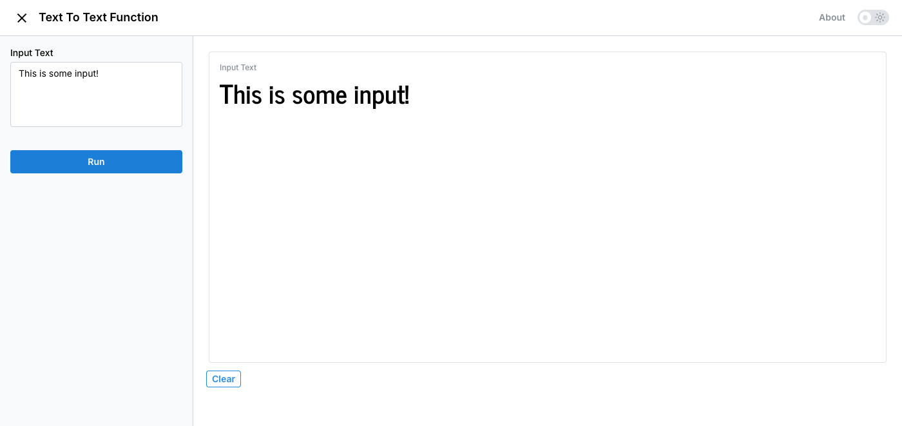
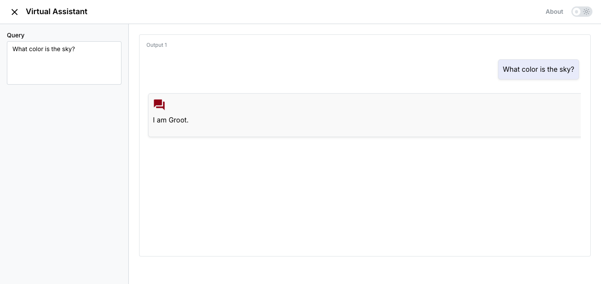
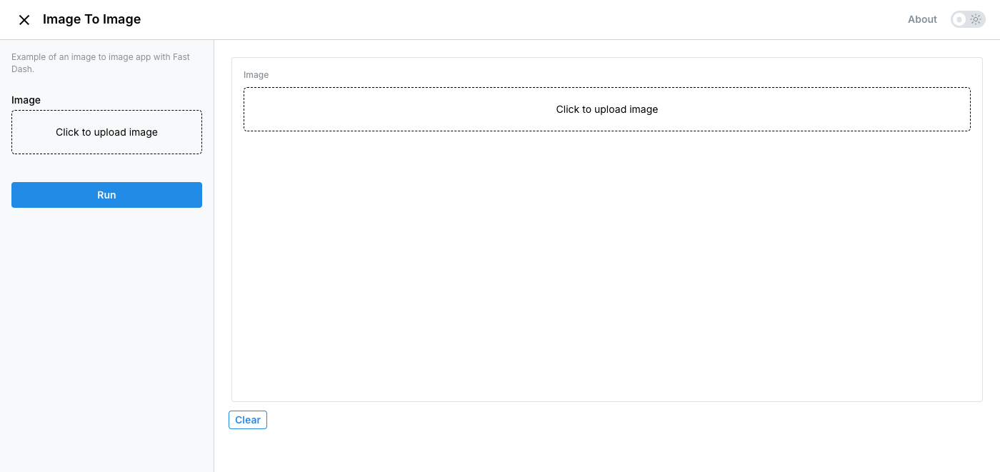

# Quickstart

## Install Fast Dash

```bash
pip install fast-dash
```

## Simple text-to-text app

The smallest possible Fast Dash app — a function with a single string parameter and a string return type. The decorator inspects the type hints, picks UI components automatically, and starts the server.

```py linenums="1"
from fast_dash import fastdash

@fastdash
def text_to_text_function(input_text: str = "This is some input!") -> str:
    return input_text
```

Open the URL printed in the terminal (default `http://127.0.0.1:8080`) and click **Run**.

<figure markdown>
  
  <figcaption>Single-input, single-output app inferred from type hints</figcaption>
</figure>

## Chatbot example

Use the built-in `Chat` output component for a conversational UI. The function takes a query string, returns a `dict(query=..., response=...)`, and Fast Dash renders it as chat bubbles.

```py linenums="1"
from fast_dash import fastdash, Chat

@fastdash(update_live=True)
def virtual_assistant(query: str = "What color is the sky?") -> Chat:
    response = "I am Groot."
    return dict(query=query, response=response)
```

`update_live=True` re-runs the function on every input change, so the chat updates without clicking Run.

<figure markdown>
  
  <figcaption>Chat output with rendered query/response bubbles</figcaption>
</figure>

## Image-to-image example

Type-hint a parameter as `PIL.Image.Image` and Fast Dash gives you an image upload component for free. Return a `PIL.Image.Image` and it renders the result.

```py linenums="1"
from fast_dash import fastdash
from PIL import Image

@fastdash
def image_to_image(image: Image.Image) -> Image.Image:
    """Example of an image-to-image app with Fast Dash."""
    return image
```

<figure markdown>
  
  <figcaption>Image upload component inferred from <code>PIL.Image.Image</code></figcaption>
</figure>

## What else is possible

- **Cascading inputs** — wire one dropdown's options to another's value with `depends_on`
- **Multi-function tabs** — pass `FastDash([fn_a, fn_b], tab_titles=[...])`
- **Multi-step pipelines** — `FastDash(steps=[fn_a, fn_b])` with `from_step` defaults
- **Streaming output** — call `update("output_id", chunk)` from inside the function
- **Authentication** — `@fastdash(auth={"alice": "secret"})` adds a password gate
- **MCP server output** — `@fastdash(mcp_server=True)` exposes the function as an AI-agent tool
- **Custom themes**, JupyterLab embedding, custom Dash components via `Fastify`, and more

By tweaking these configurations you can build web apps for a wide variety of use cases.

## Examples

See the [examples](Examples/01_simple_text_to_text.ipynb) page for more runnable notebooks.
